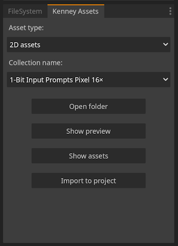

# Kenny Assets Helper

This is a Godot addon designed to make using the Kenney Game Assets All-in-1 pack easier.

## Features

You can:
- Select any type of asset you need. (2D/3D asset, audio, ...)
- Select any collection you need. (filtered by asset type)
- Open the collection folder directly.
- Show the preview of the collection.
- Open the collection's asset folder.
- Automatically import it into your project.

## Installation

1. Download the addon from the release tab or download the code as a zip.
2. Copy the addons folder to your project. 
3. Enable the plugin in your project settings. (Project > Project Settings > Plugins > Kenney Assets Viewer)

## Warning

- It only works with the [Kenney Game Assets All-in-1](https://kenney.itch.io/kenney-game-assets) zip archive. (version 1.8)
- The zip archive is large and the decompression process can be slow, so do not deactivate the plugin before it has finished unzipping it. 
- When selecting a folder in the import dialog box, you **MUST** be inside the folder and select "Select Current Folder", if you click on "Select This Folder" it will not work!

## Screenshots

## Roadmap

- [ ] Convert the project to GDScript.

## License

This project is licensed under the terms of the [Mozilla Public License, version 2.0](https://www.mozilla.org/en-US/MPL/2.0/).
